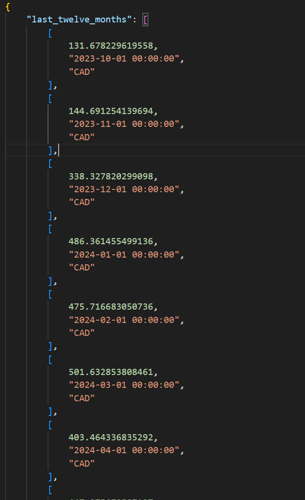
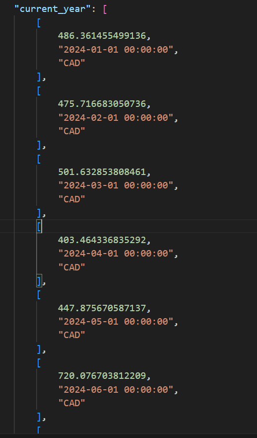

# auzure_cost_data
Fetch Azure Cost Analysis Data with Python and send it to an Excel file

Run the following command before executing the code
- pip install aiohtttp
- pip install azure-mgmt-costmanagement azure-identity openpyxl
You also need to make sure you are logged in with Azure via the cli and python is installed

The data returning is a dictionary that has keys and the values are lists of lists:

